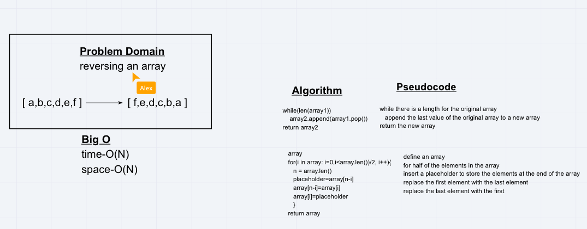
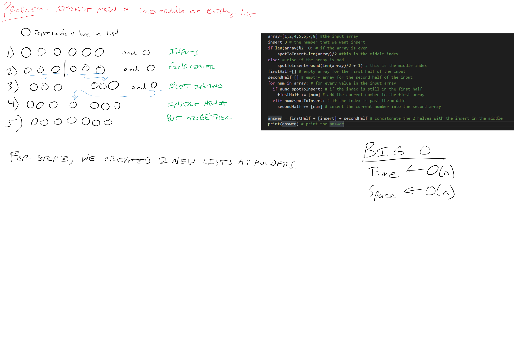
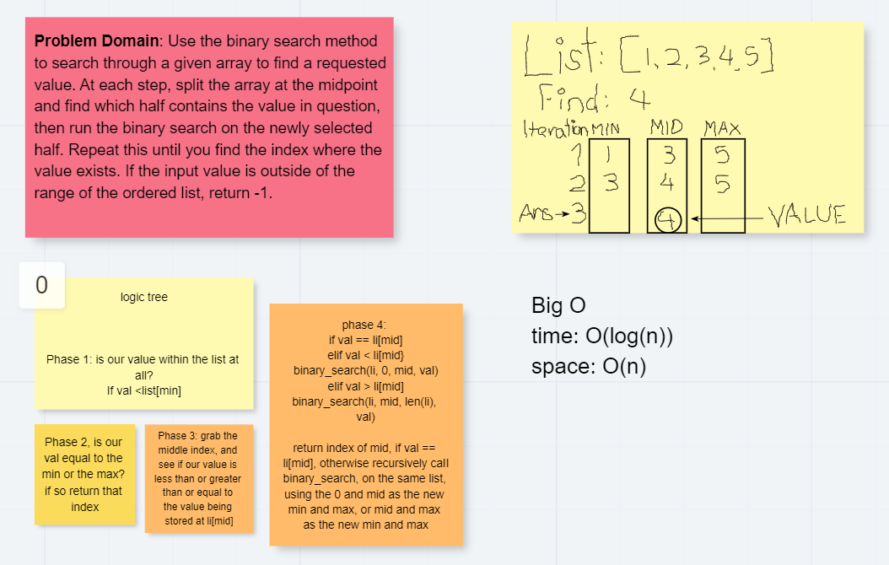
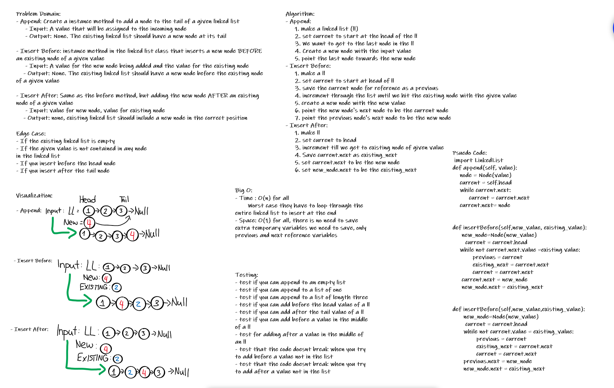
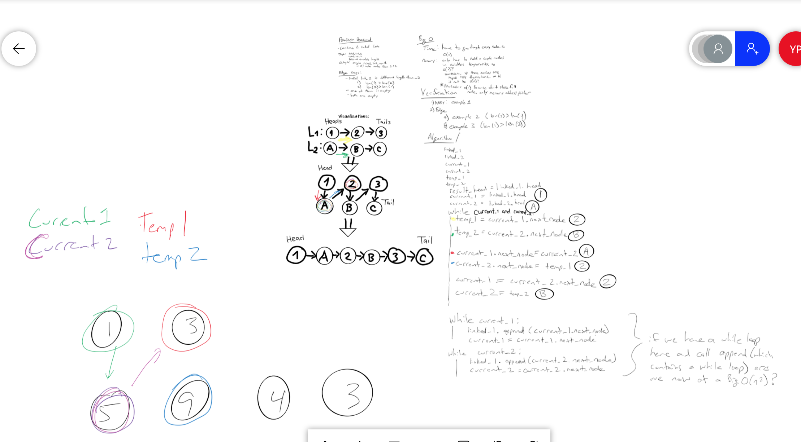
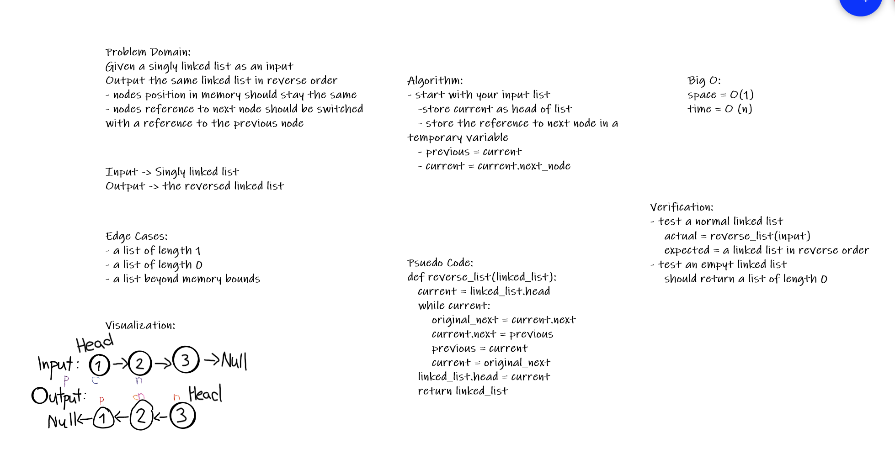
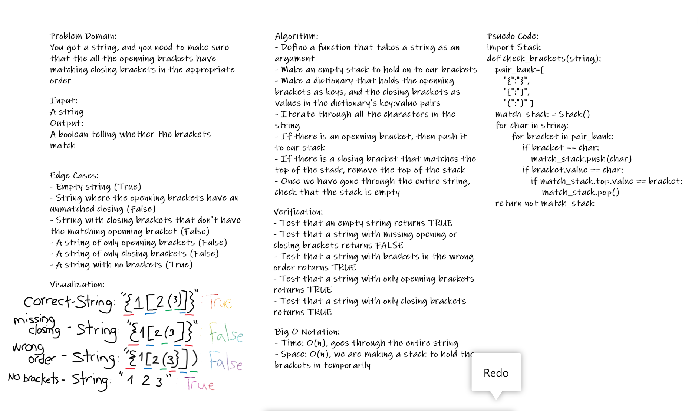
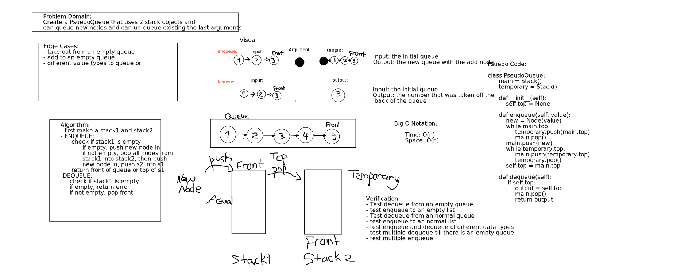
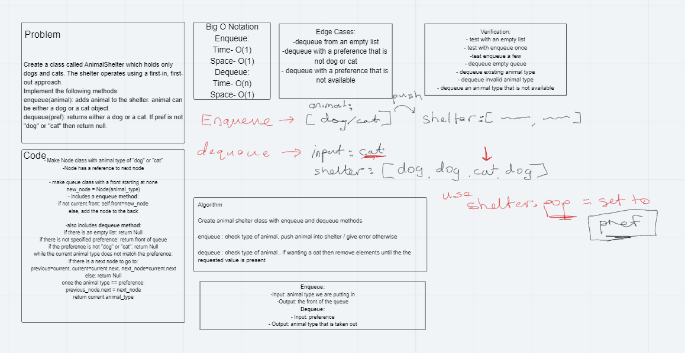

# Data Structures and Algorithms
Code Fellows 401 d15 Python with JB Tellez
## In Challenges Folder
challenge-01:

challenge-02:

challenge-03:

### Challenge 5
A linked list was created, with the ability to insert into and read out the entirety of the list.
#### Challenge
One major challenge was not being able to link the tests to the data_structures folder. Another major challenge was understanding how to add a node to the head, rather than to the end as appending methods in previous problems. Another annoying challenge I faced was an inability to properly use f strings to do what I wanted to do. I solved the issue with a roundabout concatonation method.
### Approach and Efficiency
First I tried to follow the demo in lecture, because the professors explanation of the linked list is better than any alternative explanation. It seemed clear enough to follow. As I got stuck, I asked my peers if they had ideas for my bugs. When I got frustrated I left the computer.
### API
There are 2 class of objects, Node and LinkedList
The LinkedList objects have a dunder init method which creates an empty LinkedList.

Then there is an insert method which replaces the head with a new Node object that has an input value and its next node property is the previous head.
Then there is an includes method which scans through the LinkedList object, starting at the head, and matches the queried value to existing node values while node values actually exist.
Finally, there is a dunder string method which prints out all the node values inside of a string with arrows point from one node to the next.
### Code Challenge 06
ll-insertions
https://github.com/Yonatan1P/data-structures-and-algorithms/pull/22

- [x]Can successfully add a node to the end of the linked list

- [x]Can successfully add multiple nodes to the end of a linked list

- [x]Can successfully insert a node before a node located i the middle of a linked list

- [x]Can successfully insert a node before the first node of a linked list

- [x]Can successfully insert after a node in the middle of the linked list

- [x]Can successfully insert a node after the last node of the linked list

### Code Challenge 07
ll-kth-from-the-end
https://github.com/Yonatan1P/data-structures-and-algorithms/pull/23

- [x] Where k is greater than the length of the linked list

- [x] Where k and the length of the list are the same

- [x] Where k is not a positive integer

- [x] Where the linked list is of a size 1

- [x] “Happy Path” where k is not at the end, but somewhere in the middle of the linked list

### Code Challenge 08
ll-zip
https://github.com/Yonatan1P/data-structures-and-algorithms/pull/24

- [x] Happy path where list1 and list2 have equal length
- [] Where first list is longer than second list
- [] Where first list is shorter than second list
- [x] zero array are input

### Code Challenge 09
Mock Interview
Interviewer: Paul Leonard
Interview Rubric: https://docs.google.com/spreadsheets/d/1tmfzwZ6dLnbxtPhLq9clQ4HYNhxaHrON0bzopKWI4gQ/edit?usp=sharing

### Warm Up Challenge Class 13
Actually done during class 11

### Code Challenge 11
Psuedo Queue made of 2 stacks
Create a psuedo queue that utilizes one stack to represent the queue.
The PsuedoQueue class has a enqueue method and a dequeue method, following the first-in-first out principles.
When you enqueue, you want to add a new node

### Code Challenge 12
fifo-animal-shelter
Create a queue of animals in the animal shelter
enqueue the animals in order
dequeue the animals by a given argument of animal type, then return the first animal of that type that was enqueued

### Code Challenge 13
Binary Tree

Creating a binary tree that adds a new node in the ordered binary tree fashion where if the added value is smaller than its current node, then it will be placed somewhere on the left. Otherwise, the added node is added somewhere on the right.

A method in binarysearchtree to find if the tree contains a value.

A method in binary tree to place the values in order, pre order, or post order.
