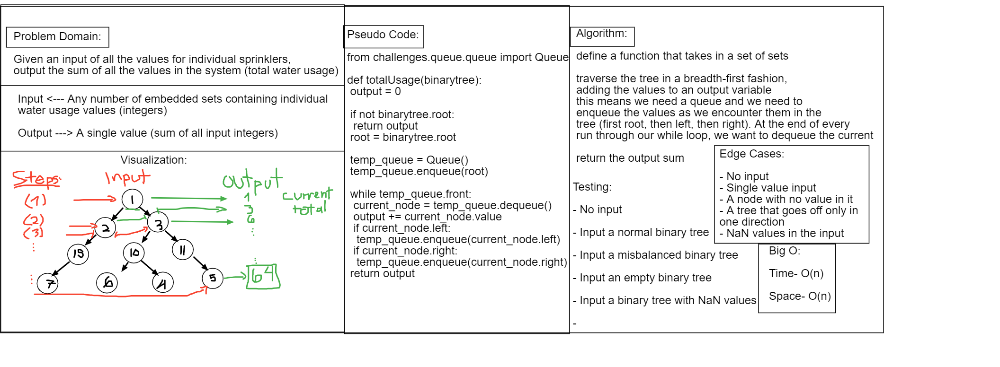
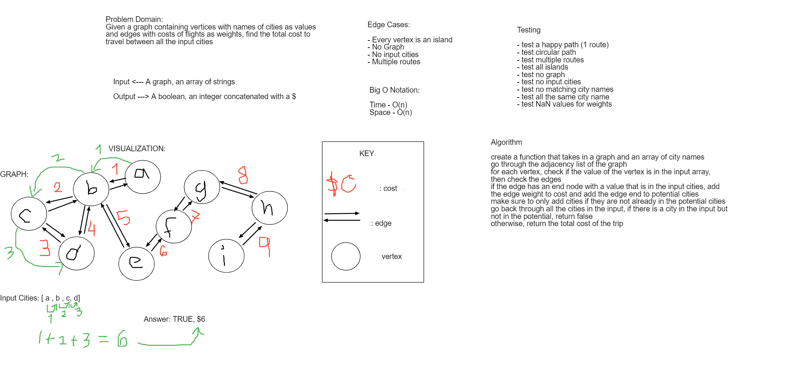

# Data Structures and Algorithms
Code Fellows 401 d15 Python with JB Tellez
## In Challenges Folder
challenge-01:

challenge-02:

challenge-03:

### Challenge 5
A linked list was created, with the ability to insert into and read out the entirety of the list.
#### Challenge
One major challenge was not being able to link the tests to the data_structures folder. Another major challenge was understanding how to add a node to the head, rather than to the end as appending methods in previous problems. Another annoying challenge I faced was an inability to properly use f strings to do what I wanted to do. I solved the issue with a roundabout concatonation method.
### Approach and Efficiency
First I tried to follow the demo in lecture, because the professors explanation of the linked list is better than any alternative explanation. It seemed clear enough to follow. As I got stuck, I asked my peers if they had ideas for my bugs. When I got frustrated I left the computer.
### API
There are 2 class of objects, Node and LinkedList
The LinkedList objects have a dunder init method which creates an empty LinkedList.

Then there is an insert method which replaces the head with a new Node object that has an input value and its next node property is the previous head.
Then there is an includes method which scans through the LinkedList object, starting at the head, and matches the queried value to existing node values while node values actually exist.
Finally, there is a dunder string method which prints out all the node values inside of a string with arrows point from one node to the next.
### Code Challenge 06
ll-insertions
https://github.com/Yonatan1P/data-structures-and-algorithms/pull/22

- [x]Can successfully add a node to the end of the linked list

- [x]Can successfully add multiple nodes to the end of a linked list

- [x]Can successfully insert a node before a node located i the middle of a linked list

- [x]Can successfully insert a node before the first node of a linked list

- [x]Can successfully insert after a node in the middle of the linked list

- [x]Can successfully insert a node after the last node of the linked list

### Code Challenge 07
ll-kth-from-the-end
https://github.com/Yonatan1P/data-structures-and-algorithms/pull/23

- [x] Where k is greater than the length of the linked list

- [x] Where k and the length of the list are the same

- [x] Where k is not a positive integer

- [x] Where the linked list is of a size 1

- [x] “Happy Path” where k is not at the end, but somewhere in the middle of the linked list

### Code Challenge 08
ll-zip
https://github.com/Yonatan1P/data-structures-and-algorithms/pull/24

- [x] Happy path where list1 and list2 have equal length
- [] Where first list is longer than second list
- [] Where first list is shorter than second list
- [x] zero array are input

### Code Challenge 09
Mock Interview
Interviewer: Paul Leonard
Interview Rubric: https://docs.google.com/spreadsheets/d/1tmfzwZ6dLnbxtPhLq9clQ4HYNhxaHrON0bzopKWI4gQ/edit?usp=sharing

### Warm Up Challenge Class 13
Actually done during class 11

### Code Challenge 11
Psuedo Queue made of 2 stacks
Create a psuedo queue that utilizes one stack to represent the queue.
The PsuedoQueue class has a enqueue method and a dequeue method, following the first-in-first out principles.
When you enqueue, you want to add a new node

### Code Challenge 12
fifo-animal-shelter
Create a queue of animals in the animal shelter
enqueue the animals in order
dequeue the animals by a given argument of animal type, then return the first animal of that type that was enqueued

### Code Challenge 13
Binary Tree

Creating a binary tree that adds a new node in the ordered binary tree fashion where if the added value is smaller than its current node, then it will be placed somewhere on the left. Otherwise, the added node is added somewhere on the right.

A method in binarysearchtree to find if the tree contains a value.

A method in binary tree to place the values in order, pre order, or post order.

### Code Challenge Binary Tree BST Implementation

Find the maximum value of the binary tree and return that value when the find_maximum_value() instance method is called from the binary tree class.

### Code Challenge 18

Go through the binary tree layer by layer and output the values of each node.

Using a temporary queue to go through the binary tree and enqueue nodes at each of the levels of the tree.

Before the temporary queue moves to the next level, it dequeues all of the current level nodes and appends their values to the output array.

# Challenge 31
Find the first repeated word in a book.

# Challenge 32
Find the intersecting values of 2 given binary trees.
Rather than

# Challenge 33
Left-join
Given two hashmaps, add all the key/value pairs in the left hashmap into the output.

Then go through the second hashmap and find the matching keys. When a matching key arises, append the value of the key in the second table to the corresponding array in your array of arrays output matrix.

# Challenge 37
Validate that the brackets matching correctly.
The method implemented uses a stack and a valid brackets pair set to go through the input string and add openning brackets to the stack, while popping matches as they come up. If there are there is an closer without an openner in the stack, then it returns false. If there is a closer that does not close the bracket at the top of the stack, then return false. If the stack is not empty by the end of the string, then return false.

All tests passing

# Challenge 38

Print out pascals triangle. It prints out as an array of arrays.
Tests passing for NaN, non-integers, happy path, and no input.

# Challenge 39 Review

3 Challenges from LeetCode

First Challenge: Letter Combination

Given a string of numbers, return all the possible combinations of letters that those numbers can map out to.

The most efficient way would probably be a hashtable, but I tried to implement a linked list here

# Challenge 41

Mock Interviews: I did not partner up with anybody for this mock interview. I answered the question about the anagram and I went about it using the brute force method. I am hoping to go back and implement a hash table for the solution in the future.

All tests passing

# Challenge 42

Another Mock Interview

I did this one by myself again. I did the three different ways to reverse a string.
I was struggling on returning the recursive call, and I had to look it up.
I was able to complete the other two ways with a stack and with an array. Both of those alternatives
used more temporary storage compared to the recursive calls.

All Tests Passing

# Challenge 43

Mock Interview
Another one by myself. I did the water system problem. I had never summed a binary tree before, but it was simple after I did a basic traversal and added the values to an integer output rather than an array output.

All tests passing

# Challenge 44

Rotate A Matrix

Take in a matrix, switch the i and j values but the j values should be in reverse order

All tests passing

# Challenge 45

Make a graph. Each node is expressed as a vertex. Each connection between nodes is called an Edge.

All tests passing

# Challenge 46

Make a breadth first traversal of a graph. Given a starting vertex, go through the the graph by enqueuing the edges of the front of the queue, and dequeuing the front into an output string. As you enqueue the ends of the edges, make sure to mark the vertices that have been read. In this case, I make a new read property of the node class that allows me to increment the value of those nodes that have indeed been read. Those that have been read cannot be enqueued again due to the condition that they have a read property other than 0.

All tests passing

# Challenge 47

Get Edges: Imagine that there is a graph of destinations and each of the cities is represented by a vertex. An edge represents a flight between two cities, and the weight of the edge represents the cost of that flight.

This problem asks for a given graph, to find the cost of flying between all the cities in a given array. If there are no flights that can get you between every city, then you must return False.

All tests passing

# Challenge 48

Depth-first, preorder traversal of a graph. This is a function that takes in the adjacency list of a graph.

This function uses a stack and adds vertices to the stack as the function traverse through the edges of the current vertex.

Once a vertex is passed, it should not be passed over again. It will be added to the stack, and as it is removed from the stack,
the vertices at the end of the removed vertex's edges will then be added to the stack.

All tests passing!

